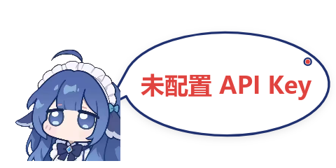

# DSH Monitor · 鲸鱼娘余额气泡

> 一个 [MiraBox Craft](https://mirabox.net/) 副屏控件（`mPanelPlugin`）：把 DeepSeek 的**余额 / 今日已用 / 赠送充值**画成一只鲸鱼娘，配上横向椭圆气泡，常驻在你的机箱小屏上。
>
> **直接调用 DeepSeek 官方余额接口，不需要 DSH。**


---

## 特性

- 🐋 **鲸鱼娘 + 椭圆气泡** —— 气泡为横向扁椭圆，蓝色描边（`#203170`），尖角指向鲸鱼
- 💰 **实时余额**：大字号主视觉，一眼看清
- 📊 **今日已用**：本地记账（累加余额下降量），随配置持久化
- 🎁 **赠送 / 充值余额**：官方接口直接提供，不依赖任何外部统计
- 🕐 **峰谷标识**：文案默认玩「梁文峰 / 梁文谷」的梗，可切换为「高峰时段 / 空闲时段」
- 🔌 **零中间层**：只依赖 `api.deepseek.com`，不经过 DSH 或任何本地服务
- 📐 **尺寸自适应**：宽高比变化时自动在「左右排布」和「上下排布」之间切换；椭圆按目标比例取最大内接
- 🧩 **错误状态明确**：未配置 Key / Key 无效 / 网络不可用 / 返回异常 各有独立提示，不会静默失败
- 🟢 **状态灯**：绿=正常、黄=查询中、红=失败

## 预览

| 默认尺寸 480×240（谷时） | 默认尺寸 480×240（峰时） |
|---|---|
|  |  |

| 320×160 | 480×160 | 方形 200×200 |
|---|---|---|
|  |  |  |

| 未配置 API Key | API Key 无效 | 网络不可用 |
|---|---|---|
|  |  |  |

> 以上预览图全部由 `node tools/pixeltest.js` 用插件**真实绘制代码**离线渲染生成，不是手工画的示意图。

## 安装

1. 下载本仓库（或 [Release](../../releases) 里的 zip）
2. 把 `com.hamiy.dshmonitor.mPanelPlugin` 整个文件夹放进：

   ```
   %APPDATA%\HotSpot\MiraBox Craft\plugins\
   ```

   最终路径应为：

   ```
   C:\Users\<你的用户名>\AppData\Roaming\HotSpot\MiraBox Craft\plugins\com.hamiy.dshmonitor.mPanelPlugin\manifest.json
   ```

3. **完全退出** MiraBox Craft（注意是托盘右键退出，不是关窗口）
4. 重新打开，在组件列表找到分类 **DSH** → 控件 **DSH Monitor**，拖到画布上
5. **右键控件 → 设置 → 填入 DeepSeek API Key → 点「测试连接」确认**

> ⚠️ 修改插件代码后**必须重启** MiraBox Craft。QtWebEngine 会缓存插件页面，仅替换文件不会生效。

## 配置

右键画布上的控件 → 设置：

| 选项 | 默认 | 说明 |
|---|---|---|
| **API Key** | 空 | DeepSeek API Key，在 [platform.deepseek.com](https://platform.deepseek.com/api_keys) 创建 |
| 峰谷文案 | 梁文峰 / 梁文谷 | 可切换为「高峰时段 / 空闲时段」或「!?峰峰?! / !?谷谷?!」 |
| 刷新间隔 | 60 秒 | 最小 10 秒 |
| 今日已用 | 开 | 是否显示今日已用（本地记账） |
| 赠送/充值 | 开 | 是否显示赠送与充值余额 |

面板里的**「测试连接」**会直接打一次接口并告诉你结果，不依赖控件状态，方便排查。

**交互**：点一下控件可立即刷新。

### 关于 API Key 的安全性

Key 由属性面板填写后，**与其它控件设置一起明文保存在 MiraBox Craft 的主题配置里**（`%APPDATA%\HotSpot\MiraBox Craft\profiles\*.mPanelTheme\manifest.json`）。这是 MiraBox Craft 的配置机制所决定的，插件无法加密存储。

因此：

- 请在 DeepSeek 平台为这个小控件**单独创建一个 Key**，便于随时吊销
- **不要**在这台机器以外的地方复用同一个 Key
- 如果这台机器与他人共用，请自行评估

> 早期版本（v2.x）之所以不存 Key，是因为它复用 DSH 侧的本地接口。v3 为了摆脱 DSH 依赖才改为直连，这个取舍需要你知情。

## 工作原理

MiraBox Craft 使用 **StreamDock 插件协议**（文档：[sdk.key123.vip](https://sdk.key123.vip/)）。一个控件由三部分组成：

```
com.hamiy.dshmonitor.mPanelPlugin/
├── manifest.json              声明控件（UUID / 图标 / 默认配置 / 控制器）
├── plugin/
│   ├── index.html             入口页（manifest 的 CodePath）
│   ├── sdk.js                 与主程序的 WebSocket 通信层 + 画布工具
│   └── index.js               数据获取 + 绘制逻辑
├── propertyInspector/
│   └── index.html             右键设置面板
└── static/
    ├── icon.png               控件图标
    └── whale.png              鲸鱼娘立绘
```

主程序加载 `plugin/index.html` 后会调用全局函数：

```js
connectElgatoStreamDeckSocket(port, pluginUUID, registerEvent, info)
```

插件据此建立到 `ws://127.0.0.1:<port>` 的 WebSocket 并注册，之后：

| 方向 | 事件 |
|---|---|
| 主程序 → 插件 | `willAppear`（拖入画布）、`willDisappear`、`didReceiveSettings`、`keyUp`（点击） |
| 插件 → 主程序 | `setImage`（显示图像）、`setTitle`（显示文字）、`setSettings`（存配置） |

所以「显示任意内容」的本质就是：**定时算出想显示的画面 → 画成 PNG → `setImage` 推给屏幕**。

### 数据来源

每 `刷新间隔` 秒请求一次：

```
GET https://api.deepseek.com/user/balance
Authorization: Bearer <API Key>
```

返回：

```json
{
  "is_available": true,
  "balance_infos": [
    { "currency": "CNY", "total_balance": "11.12",
      "granted_balance": "0.00", "topped_up_balance": "11.12" }
  ]
}
```

官方接口只给**当前余额**、没有用量历史，所以另外两项是本地推算的：

- **今日已用**：累加余额的下降量。中途充值不会把已用量冲掉（只累加下降）。跨天按**北京时间**归零。
- **峰谷状态**：按官方时段本地判定 —— 工作日 `9:00–12:00`、`14:00–18:00` 为高峰，其余为空闲；**周末全天按谷价**（2026-08-23 起）。

### 几个实现细节

- **椭圆里的排版**：椭圆的可用宽度随高度变化（中间最宽、上下收窄），因此逐行按该行高度反算宽度（`halfW = rx·√(1−(dy/ry)²)`），而不是套用外接矩形——否则四角的字会被椭圆切掉。
- **尖角与椭圆合成单条路径**：若先画椭圆再补三角形，接缝处会留下一条横穿尖角根部的描边线。这里让 `ctx.ellipse()` 绕整圈时留出缺口，直接 `lineTo` 到尖角顶点再闭合，做到一次填充、一次描边。
- **状态灯定位**：按椭圆参数方程 `(rx·cosθ, ry·sinθ)` 取点后沿该方向内收，保证与描边之间始终留有净空 —— 早期版本固定在 `-45°、0.94 半径` 处，椭圆压扁后净空会变成负数（灯压在边框上）。
- **鲸鱼图本地打包**：立绘随插件分发，所以**断网时鲸鱼照样显示**，只是气泡里写错误原因。

## 本地开发

插件代码是纯浏览器 JS，可以用 Node 离线驱动真实的绘制逻辑，改完先本地验证再装进软件，省去反复重启。

**准备**（`@napi-rs/canvas` 不随本仓库分发）：

```powershell
cd tools
npm i @napi-rs/canvas
```

或者直接复用 MiraBox Craft 自带的那份，设置环境变量即可：

```powershell
$env:NAPI_CANVAS="C:\Program Files\MiraBoxCraft\defaultPlugins\com.hotspot.streamdock.system.monitor.text.mPanelPlugin\plugin\node_modules\@napi-rs\canvas"
```

**跑测试**：

```powershell
node tools/smoketest.js   # 尺寸×状态矩阵冒烟（100 项），断言不抛异常
node tools/pixeltest.js   # 真实渲染 + 像素/文案自检，并重新生成 preview/
```

`tools/harness.js` 把插件加载进 VM 沙箱，用桩件补齐 `document` / `Image` / `XMLHttpRequest` / `WebSocket`，并拦截三处调用以便断言：

| 拦截 | 用途 |
|---|---|
| `ctx.ellipse()` | 读插件算出的椭圆半径，验证长宽比 |
| `ctx.fillText()` | 读真正画出去的字符串，验证文案分支 |
| `WebSocket.send()` | 截获 `setImage` 的 dataURL，拿到最终画面做像素统计 |

自检里有两处是踩过坑才加上的，值得说明：

- **状态灯必须用连通域聚类定位**，不能对同色像素直接求质心 —— 谷时文案「梁文谷」的绿色与状态灯同色系，抗锯齿边缘会把质心拉偏 10px 以上。
- **还要限制连通域尺寸** —— 失败态的红色文字与红灯同色，不限制尺寸会挑到字形，测出与真实位置无关的净空。

## 素材来源与许可

> ⚠️ **本项目代码是 MIT；但鲸鱼娘立绘不是 MIT 素材**，请勿当作 MIT 内容再分发。

### 本项目代码

以 **MIT License** 开源，详见 [LICENSE](LICENSE)。

### 第三方内容

| 文件 / 内容 | 来源 | 许可 |
|---|---|---|
| `static/whale.png`（鲸鱼娘立绘） | [MeteorNOX/DeepSeek-Balance-Whale-Widget](https://github.com/MeteorNOX/DeepSeek-Balance-Whale-Widget) 的 `assets/DSniang1.png` | **不适用 MIT** —— 见下方说明 |
| 峰谷文案「梁文峰 / 梁文谷」、配色 `#e0433f` / `#2fa24c` / `#203170`、峰谷时段规则 | 同上项目的**代码**部分 | MIT，© 2026 MeteorNOX |
| 插件协议与 SDK 约定 | [StreamDock Plugin SDK](https://sdk.key123.vip/) | 归各自权利人 |
| `static/icon.png` | 本项目自制 | 同本项目 |

**关于鲸鱼娘立绘**：上游仓库自 0.3.5 起明确声明，`assets/` 下的美术素材**不在 MIT 覆盖范围内**，按 as-is 分发、**不授予再许可**，并说明该图由 AI 工具生成、原始出处已不可考。（上游 0.3.0 及更早版本只有一句「本项目基于 MIT License 开源」，没有这条例外说明；本仓库初版据此标注为 MIT，现已按新口径更正。）

因此本仓库**不声称对该图片拥有任何权利**，也**不将其纳入本项目的 MIT 授权**。它仅作为运行本控件所必需的资源随包分发，与上游自己的分发方式一致。若你是该图片的权利人并希望我们移除，请[开一条 issue](../../issues) 说明文件名与依据，我们会立即替换或移除。

想换成自己的立绘：替换 `static/whale.png` 即可（建议方形、带透明通道）。删掉该文件不会导致控件崩溃，只会显示一个占位圆圈。

完整说明与上游 MIT 许可证原文见 [THIRD-PARTY-NOTICES.md](THIRD-PARTY-NOTICES.md)。

### 免责声明

本项目为个人作品，与 DeepSeek、MiraBox（妙联宝）官方均无关联，未获其背书。「DeepSeek」「MiraBox」等名称与商标归各自权利人所有。

## 已知限制

- **「今日已用」只统计控件运行期间的消耗。** 控件没在跑的时候发生的用量统计不到 —— 官方接口不提供用量历史，这是原理上的限制。
- **没有「本轮对话花费」。** 那需要 DSH 的会话事件，v3 已移除该依赖，因此这一项不再提供。
- **跨源请求**：插件页是 `file://`，请求 `https://api.deepseek.com` 属于跨源。MiraBox Craft 的插件页可跨域取第三方 API（自带插件即如此），实测可用；若某天被拦，错误会以「网络不可用」显式暴露。
- **仅在 Windows + D5 竖屏上实测**。插件代码本身与平台无关，但安装路径是 Windows 的。

## 更新日志

### 3.0.0
- **改为直连 DeepSeek 官方余额接口，不再依赖 DSH。** 起因是 `dsh-whale-widget` 0.3.0 给所有本地路由套上了 DSH 的信任围栏（`conn.requestRejection`），未带浏览器会话的请求一律 401，控件因此失效
- 新增 API Key 配置项与「测试连接」按钮
- 新增错误状态区分：未配置 Key / Key 无效 / 网络不可用 / 超时 / HTTP 错误 / 返回异常
- 「今日已用」改为本地记账（累加余额下降量，跨天按北京时间归零）
- 「本轮花费」移除（需要 DSH 会话事件）；改为显示**赠送 / 充值余额**（官方接口直接提供）
- 冒烟测试从 49 项扩到 100 项，覆盖全部失败态

### 2.4.1
- **修复：状态灯压在气泡描边上。** 旧定位固定在 -45°、0.94 半径处，椭圆压扁后净空为负（实测 480×240 下 +0.5px、240×120 下 −0.2px，即与描边重叠）
- 状态灯改为按椭圆参数方程定位并沿该方向自动内收，任何尺寸下都保留约 3–5.5px 净空

### 2.4.0
- 默认控件尺寸放大一倍：320×160 → 480×240

### 2.3.0
- 椭圆长宽比 1.6 → 2.0，明显更扁更宽
- 新增：椭圆压扁导致行高不足时，两条明细自动合并为一行

### 2.2.0
- 椭圆引入目标长宽比，不再简单铺满外接框（此前气泡接近正圆）

### 2.1.0
- 气泡改为椭圆 + 蓝色描边 `#203170`
- 修复：`roundRect()` 无条件 `ctx.stroke()` 导致每个圆角矩形被描了一圈默认黑边
- 修复：属性面板 `setSettings` 整体替换会冲掉 `ActionGeometry`（控件尺寸）

### 2.0.0
- 改为鲸鱼娘 + 气泡样式，峰谷文案改为「梁文峰 / 梁文谷」
- 鲸鱼立绘随插件本地打包

### 1.0.0
- 首个可用版本
